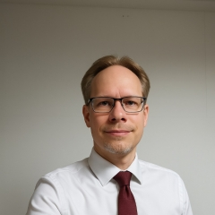

# TWG·FAS Contributors

This page introduces the people contributing to the Technical Working Group for Formal Automotive Systems (TWG·FAS).

---

## Thomas Scheuerle

**Role:** Founder, Technical Working Group for Formal Automotive Systems (TWG·FAS)

**Affiliation:** Robert Bosch GmbH
Participation in TWG·FAS is in a personal capacity unless explicitly stated otherwise.

**Areas of Interest**

- Formal Methods
- Autonomous Driving
- Artificial Intelligence
- Functional Safety
- Vehicle Machine Language (VML)
- Runtime Verification
- System Architecture

### Biography

Thomas Scheuerle is a software and systems engineer working in the field of automated and autonomous driving systems. His work focuses on the development of safety-critical vehicle functions, formal behavioral specification, and verification methodologies for next-generation automotive software platforms.

He is the founder of the Technical Working Group for Formal Automotive Systems (TWG·FAS), an independent open initiative dedicated to establishing vendor-neutral standards for formal behavioral representation in AI-driven automotive systems.

His current research interests include the intersection of formal methods, artificial intelligence, verification, explainability, and runtime assurance. Through TWG·FAS he advocates the use of formal intermediate representations such as the Vehicle Machine Language (VML) as a bridge between natural-language engineering artefacts and certifiable automotive runtime systems.

### Contributions to TWG·FAS

- Founder of the initiative
- Author of the initial VML concept
- Maintainer of the TWG·FAS website
- Author of the first technical drafts and white papers
- Outreach and community building

### Contact

- Website: https://twg-fas.org
- LinkedIn: https://www.linkedin.com/in/scheuerle/

---
``